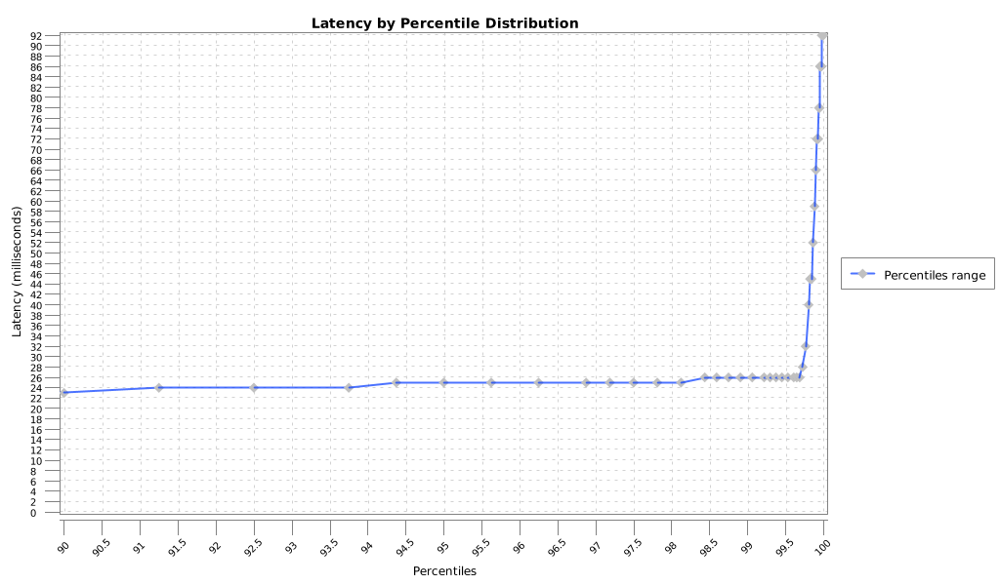
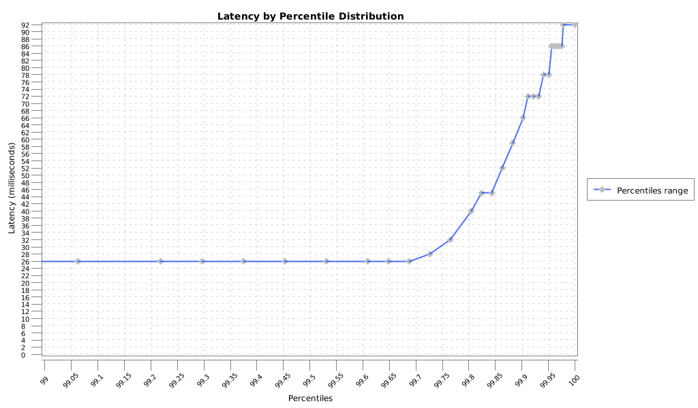
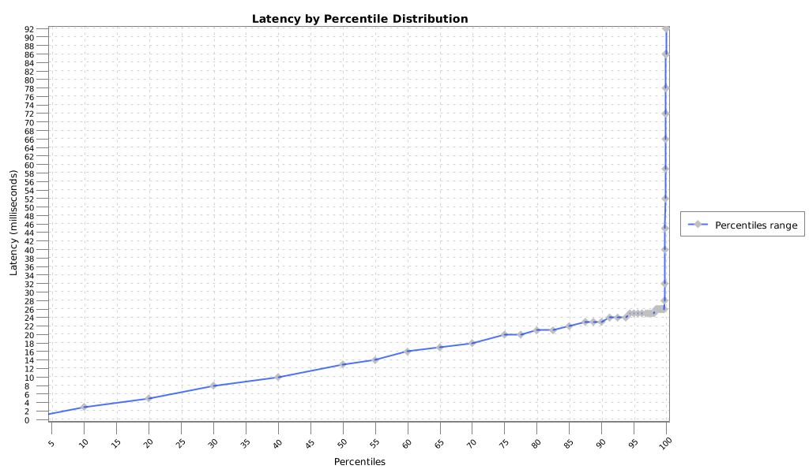

HDR Histogram Plotter: A Java library to plot HDR Histogram Files
============

Build Status
----

Build Status: [](https://travis-ci.org/orpiske/hdr-histogram-plotter)

Codacy Report: [](https://www.codacy.com/app/orpiske/hdr-histogram-plotter?utm_source=github.com&amp;utm_medium=referral&amp;utm_content=orpiske/hdr-histogram-plotter&amp;utm_campaign=Badge_Grade)

Introduction
----

This library reads compressed [HDR Histogram](https://hdrhistogram.github.io/HdrHistogram/) and plot them. It makes it
easier to integrate processing of those files into custom automation tools without relying on Excel, GNUPlot or
GoogleCharts.
It can be used as a command-line tool or it can be integrated in other projects as a library.


Building
----

To build the project run:

```
mvn clean install
```

To generate the delivery tarball run:

```
mvn -PDelivery clean package
```

If you maintain your own Maven repository, you can deploy this library using:

```
mvn deploy -DaltDeploymentRepository=libs-snapshot::default::http://hostname:8081/path/to/libs-snapshot-local
```


Using as Command Line Tool
----

Run:

```
./hdr-histogram-plotter -f /path/to/sample.hdr
```

Using as Library
----

**Dependencies**:

To use this project as library on your project you have to add my personal 
[bintray](https://bintray.com/orpiske/libs-release/) repository to the pom.xml
file:

```
<repositories>
    <repository>
        <id>orpiske-repo</id>
        <url>https://dl.bintray.com/orpiske/libs-release</url>
    </repository>
</repositories>
```

Then, the library can be referenced as: 
```
<dependency>
    <groupId>net.orpiske</groupId>
    <artifactId>hdr-histogram-plotter</artifactId>
    <version>1.0.0</version>
</dependency>
```

**Note**: replace version with the latest available version you wish to use.

**API**:

The API documentation (javadoc) is available [here](http://www.orpiske.net/files/javadoc/hdr-histogram-plotter-1/apidocs/). 
Additional project documentation is available [here](http://www.orpiske.net/files/javadoc/hdr-histogram-plotter-1/).

Sample usage:

```
// HDR Converter
HdrLogProcessorWrapper processorWrapper = new HdrLogProcessorWrapper();

String csvFile = processorWrapper.convertLog(fileName);

// CSV Reader
HdrReader reader = new HdrReader();

HdrData hdrData = reader.read(csvFile);

// HdrPlotter
HdrPlotter plotter = new HdrPlotter(FilenameUtils.removeExtension(fileName));
plotter.plot(hdrData.getPercentile(), hdrData.getValue());

```

Output
----

The HDR processing will generate 4 files: 

```
/path/to/sample_90.png
/path/to/sample_99.png
/path/to/sample_all.png
/path/to/sample.csv
/path/to/sample.hdr
```

The files are, in order:

* Plotted PNG file for the 90th percentile
* Plotted PNG file for the 99th percentile
* Plotted PNG file for the all data range
* Intermediary CSV file that can be used elsewhere


Samples
----


